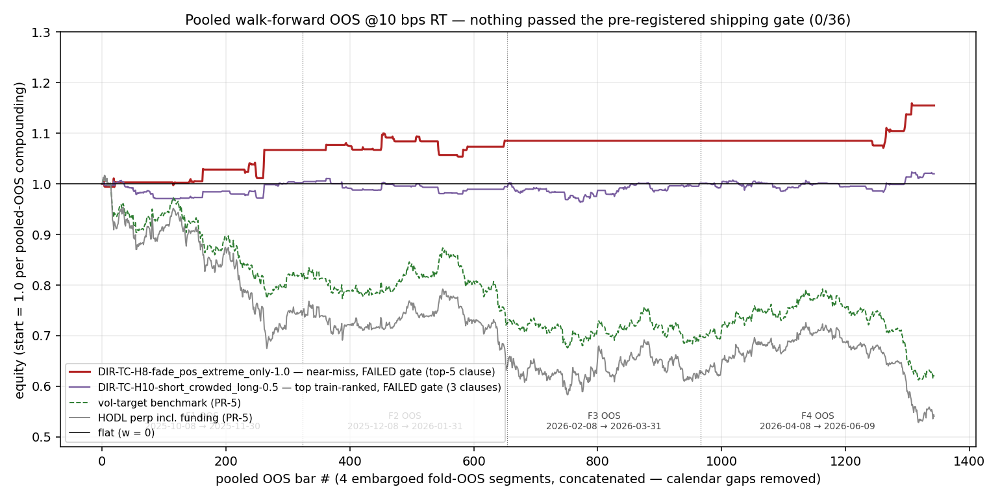
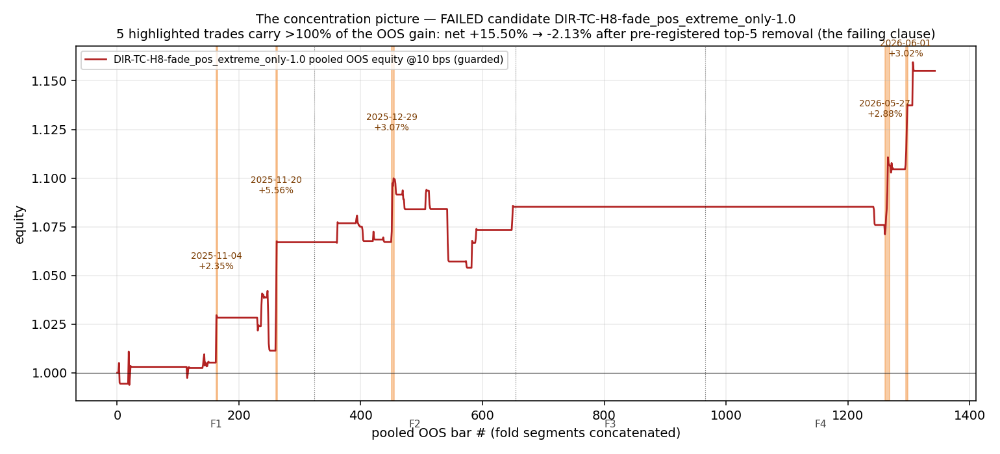
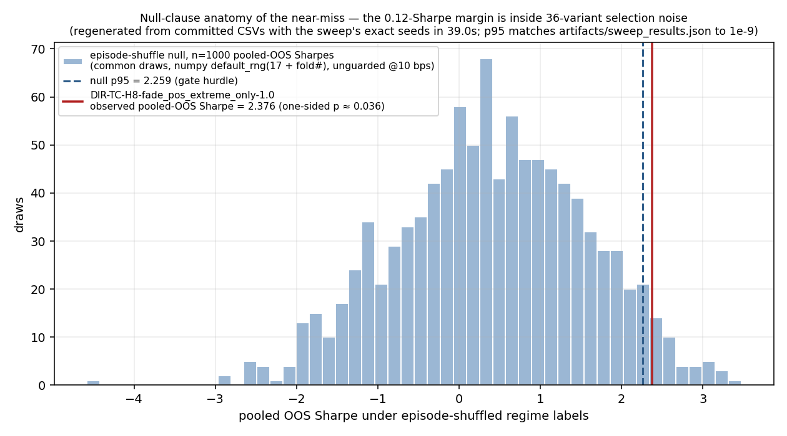
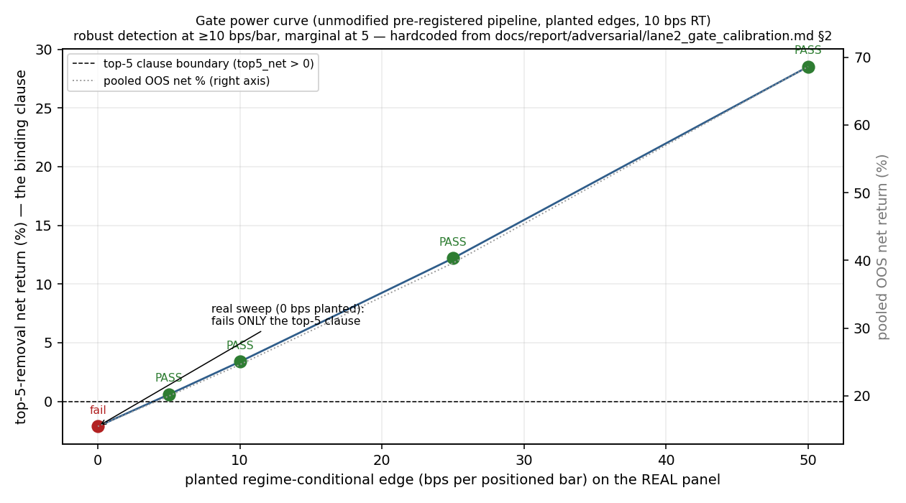
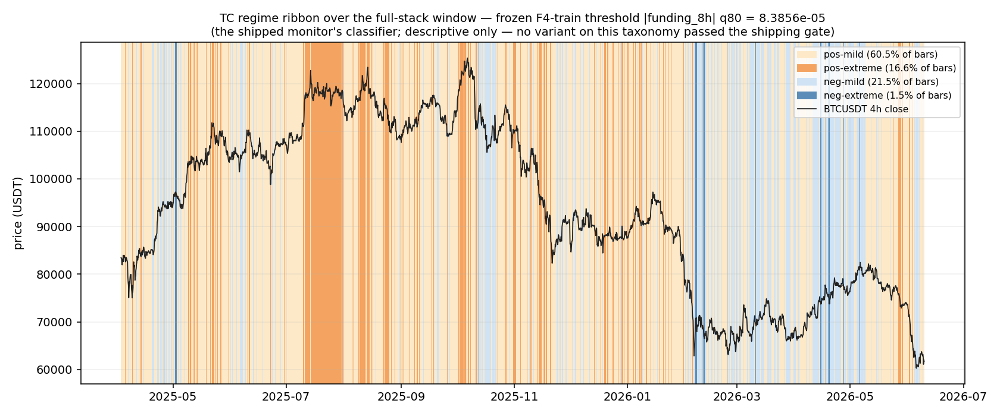
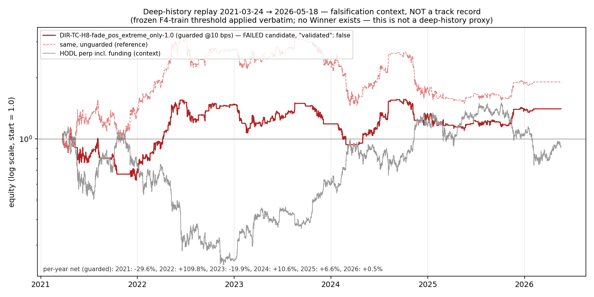

# Backtest report — BTC funding-regime Skill (BNB HACK 2026, Track 2)

Plan Task 4.1 (amended, R-NULL branch) · 2026-06-10 · binding inputs:
`docs/FREEZE.md`, ADR-001 (`docs/adr/001-select-on-train-gate-on-oos.md`),
CONTEXT.md. Every number below is re-derivable from committed files; the
artifact path is cited next to each table. Figures regenerate via
`uv run --no-sync python -m lab.report_figs` (which asserts its recomputed
numbers against `artifacts/sweep_results.json` to 1e-9 before drawing).

---

## 1. Headline: no strategy cleared our pre-registered shipping gate (0/36)

We swept **36 pre-registered variants** (two families × three taxonomy
candidates, enumerated in code, `lab/variants.py`) through a purged/embargoed
walk-forward on BTCUSDT 4h, selected on train, and gated on pooled OOS with a
five-clause shipping gate at 10 bps round-trip costs. **Zero variants
passed.** The expected pass-rate of the gate's null clause under the
episode-shuffle null is 5.0%; the observed full-gate pass rate of the top
train-ranked variant over 200 null draws is 1.5%. The outcome is consistent
with no detectable edge in this variant space on this window — and we ship
that result as-is.
*Source: `artifacts/sweep_results.json` → `.globals.r3`;
`artifacts/sweep_summary.md`.*



**What survived is the machinery, and it is the submission:**

- **A calibrated shipping gate.** The unmodified pipeline passes a planted
  regime-conditional edge of **≥ 10 bps/bar robustly and 5 bps/bar
  marginally** on the real panel (§3.4). The null result is evidence about
  the data, not the machinery.
- **A reproducible lab.** An independent adversarial lane re-wired the fold
  pipeline from the plan text and reproduced every compared scalar
  **bit-for-bit (max |diff| = 0.0)** from the committed CSVs (§3.5).
- **An honest monitor.** The Skill (`skills/btc-funding-regime-monitor/`)
  ships as a **regime monitor**: the frozen TC taxonomy
  (`pos-mild · pos-extreme · neg-mild · neg-extreme`, funding-only), the
  frozen F4-train threshold `funding_hi_abs = 8.385600000000002e-05`, and
  per-regime expected-behavior notes that are F4-train descriptive statistics
  — every note carries `"validated": false`, and no entry/exit/sizing is
  emitted at runtime, because the shipping gate validated none.
  *Source: `docs/FREEZE.md` §2–§3.*

**Honest N.** The headline sample-size unit is the pooled-OOS **regime
episode** count (ADR-001 R2): **TC = 225** (52/48/60/65 by fold; TA = 250,
TB = 105), with embargo E = 42 bars at every fold boundary. That is a
taxonomy-level count. Per the freeze's active-sample rule, any statement
about the near-miss candidate quotes its **active** OOS sample instead:
**30 trades / 92 nonzero-position bars (6.8% of 1,344 pooled-OOS bars) /
3 of 4 folds** — roughly 7× smaller than the taxonomy-level honest-N.
*Source: `artifacts/sweep_results.json` → `.globals.taxonomies`;
`docs/FREEZE.md` §3 amendment 4, §6.*

Why we lead with a null in front of this panel: the alternative — quietly
widening one quantile or trimming one clause until a "Winner" appears — was
available, measured, and refused (§3.3). The pre-registered configuration
is the entry; the near-miss it caught is the demonstration that the gate
works.

---

## 2. Method

### 2.1 Select on train, gate on OOS (ADR-001)

Ranking key = mean per-fold **train** Sharpe @10 bps RT (tiebreak: lower mean
train max-DD). Pooled OOS is used ONLY as a binary pass/fail gate, never as a
ranking key. Refinements binding on the lab:

- **R1 — train-only thresholds.** Every absolute threshold is re-derived per
  fold on that fold's train rows only; nothing inherits the rm17 full-sample
  cuts (whose window overlaps the OOS).
- **R2 — walk-forward honest-N.** The gate runs on a purged/embargoed
  walk-forward; the headline N is the pooled-OOS regime-episode count, not
  trades or bars.
- **R3 — multiple-testing disclosed.** Total variants, gate passes, and the
  expected pass-rate under the shuffle null are published (§3.1), not waved
  away.

### 2.2 Walk-forward (PR-6)

Expanding folds, calendar-UTC boundaries, embargo E = max(42 bars, median
regime-episode length) = **42 bars (7 days)** for all three taxonomies.

```
full-stack window: 2025-04-03 00:00 -> 2026-06-09 20:00 UTC (2,598 4h bars)

F1  |== train 2025-04-03 .. 2025-10-01 ==|--E--|== OOS 10-08 .. 11-30 ==|
F2  |== train 2025-04-03 .. 2025-12-01 ========|--E--|== OOS 12-08 .. 01-31 ==|
F3  |== train 2025-04-03 .. 2026-02-01 ==============|--E--|== OOS 02-08 .. 03-31 ==|
F4  |== train 2025-04-03 .. 2026-04-01 ====================|--E--|== OOS 04-08 .. 06-09 ==|
         (train = every bar strictly before the boundary; E = 42-bar embargo)
```

Pooled OOS = concatenated fold-OOS segments: 324 + 330 + 312 + 378 =
**1,344 bars**. Per-fold thresholds derive on that fold's train only (R1);
the shipped frozen thresholds are the F4-train numbers — the exact numbers
gated on F4 OOS (validated thing ≡ shipped thing).
*Source: `artifacts/sweep_results.json` → `.globals.taxonomies.*.per_fold`;
fold geometry independently reproduced in
`docs/report/adversarial/lane1_reproduction.md` §1.*

### 2.3 Execution model (PR-3, fixed across all variants)

| constant | value |
|---|---|
| bars | BTCUSDT 4h (`data/lab/bars_4h.csv`) |
| fill | decided at close t → next-bar-open fill (1-bar lag lives in `lab/rules.py`, verified by a lag-tent probe, §3.4) |
| bar return | r[t] = open[t+1]/open[t] − 1 (final bar: close/open − 1) |
| costs | round-trip c bps ⇒ per-side c/2 bps on \|Δw\| traded notional; ladder {5, 10, 20}, gate rung 10 |
| funding | accrues at 00/08/16 UTC stamps: equity ×= 1 − w·rate; **short earns positive funding** (R-FUND, test-pinned, hand-verified on raw rows to 1e-16) |
| sizing | w ∈ [−1, 1], no leverage |
| DD guard | PR-4: trailing 20% equity stop, flat until next regime-label change; variants only, never benchmarks; never swept |
| Sharpe | annualized √2190 (4h bars/yr), population std |

### 2.4 Feature source consistency (PR-2 final — one source per Feature, train+OOS)

| Feature | source of record | decision & evidence |
|---|---|---|
| price / TA | `binance_klines` 4h → `data/lab/bars_4h.csv` | single live source; 7 byte-identical duplicate stamps dropped (D4.1) |
| funding | **Binance REST `fapi/v1/fundingRate` end-to-end** → `data/backfill/funding_btcusdt_binance.csv` | The CoinGlass relay **switched storage convention mid-stream on 2025-04-08** (settled-decimal-settlement-stamped → predicted-percent-interval-start-stamped). The naive pre-registered cross-check therefore failed (19.4% of rows < 1e-6); convention-aware, the two relays agree — pre-switch 291/291 rows exact, post-switch max \|diff\| = 7.768e-05 (0.78 bp on an 8h rate), 100% join coverage. This is precisely the mid-window relay hazard R-SRC exists to catch; the CG table is disqualified as a lab source. *Source: `data/backfill/funding_crosscheck.txt`.* |
| OI (level, Δ24h) | `oi_snapshots` venue=**bybit** → `data/lab/oi_bybit.csv` | only venue spanning the full-stack window (binance starts 2026-04-02). Cadence unified to daily 00:00 snapshots across the whole window (D4.2) so a mid-window cadence change cannot masquerade as a regime shift. |
| F&G | **CMC Pro REST `/v3/fear-and-greed/historical` only** → `data/backfill/fear_greed.csv` | CMC span 2023-06-29 → 2026-06-09 covers the window; fallback not triggered; identical source to what the shipped Skill reads live. *Source: `data/backfill/fg_source_decision.txt`.* |
| CVD | **DROPPED** | `cg_cvd_history` went stale 2026-05-29, mid-OOS (R-SRC; pre-approved drop) |
| LS-skew, DVOL | lab discovery only | never distilled — no Gate-0-verified CMC field (LS), not a CMC field (DVOL) |

**OI-hole sensitivity note (D4.3).** Two ~12.5-day OI/LS gaps
(2026-04-12→04-24, 2026-05-16→05-29) sit inside F4 OOS. Policy: NaN under
the staleness cap; any classifier clause referencing a NaN Feature evaluates
FALSE (deterministic, test-pinned). Consequently **TA/TB variants ran with
NaN→FALSE OI clauses on 142 of 378 F4-OOS bars** (~150; re-derivable as the
`oi_chg_24h` NaN count over the F4 OOS index of
`add_features(load_panel("full"))`). **TC consumes no OI** — the frozen
monitor taxonomy is unaffected by the holes, which is one of the pre-stated
reasons TC was frozen (`docs/FREEZE.md` §2).

---

## 3. Falsification chapter

This is the centerpiece. Both ways a null can be wrong — "the pipeline
destroyed a real edge" and "a real edge is being talked past the gate" —
were attacked by three independent adversarial lanes. Neither holds.

### 3.1 R3 disclosure (the denominator)

| quantity | value |
|---|---|
| variants swept | **36** |
| shipping-gate passes | **0** |
| expected pass-rate of the null clause under the shuffle null | **0.0500** (~5% by construction) |
| full-gate pass rate, top train-ranked variant, 200 null draws | **0.015** |
| observed null-clause passers | 2 of 36 (expected 1.8) — and they are one strategy at two sizes |

*Source: `artifacts/sweep_results.json` → `.globals.r3`;
`docs/report/adversarial/lane3_near_miss.md` §4.*

Disclosure: the beats-HODL clause was **near-vacuous on this window** — HODL's
pooled-OOS Sharpe is −2.10, so 98% of null draws clear that clause
(lane 3 §4). The clauses doing the real work were the shuffle null and
top-5 removal.

### 3.2 Anatomy of the near-miss: `DIR-TC-H8-fade_pos_extreme_only-{0.5,1.0}` — FAILED, `"validated": false`

The full spec, published here and only here (never as a tradable
recommendation):

- **Rule:** if the prior bar's TC label is `pos-extreme`
  (funding_rate_8h ≥ 0 and \|funding_rate_8h\| ≥ the fold-train q80 cut;
  F4-train: 8.385600000000002e-05), hold w = −size next bar
  (next-bar-open fill); flat otherwise. Sizes 0.5 / 1.0.
- **Execution:** PR-3 model, PR-4 DD guard (never fired in OOS), 10 bps RT
  gate rung, thresholds per-fold train-derived (R1).
- **Train rank:** #4/#5 of 36 (rank key 0.956) — not the top train pick.
- **Pooled OOS:** Sharpe 2.3763 / 2.3761, net +7.56% / +15.50%, 30 trades,
  92 of 1,344 OOS bars in position (6.8%), **F3 = zero trades** (funding
  never reached the positive cut Feb–Mar 2026).
- **Gate:** PASSES beats_flat, beats_hodl, the shuffle null (2.376 >
  null_p95 2.259; one-sided p ≈ 0.036), and the cost ladder
  (net @5/10/20 bps: +17.25%/+15.50%/+12.09% at size 1.0).
  **FAILS top-5 removal: top5_net = −1.03% / −2.13%.**

*Source: `artifacts/sweep_results.json` → variant records
`DIR-TC-H8-fade_pos_extreme_only-{0.5,1.0}`; `docs/FREEZE.md` §4.*

**The failure is substantive, not technical.** The 5 best trades — all
crash-day shorts — carry **114.8% / 116.2% of the entire OOS gain**; the
remaining 25 trades compound to **−1.03%**; hit rate 50%, median trade
+3 bp. The five removed trades (size 0.5; identical timestamps at size 1.0
at ~2× pnl):

| fold | entry | exit | w | pnl |
|---|---|---|---|---|
| F1 | 2025-11-20 12:00 | 2025-11-20 20:00 | −0.5 | +2.76% |
| F2 | 2025-12-29 04:00 | 2025-12-29 20:00 | −0.5 | +1.53% |
| F4 | 2026-06-01 20:00 | 2026-06-02 12:00 | −0.5 | +1.50% |
| F4 | 2026-05-27 04:00 | 2026-05-28 12:00 | −0.5 | +1.43% |
| F1 | 2025-11-04 04:00 | 2025-11-04 12:00 | −0.5 | +1.17% |

*Source: `docs/report/adversarial/lane3_near_miss.md` §1 (hand-recomputed,
matches the artifact to 10 decimals).*



The one accounting asymmetry found (trade pnl excludes the exit fill cost,
making the hook marginally harsher) was checked: crediting exit costs back
leaves top5_net at **−0.91% / −1.88%** — still clearly negative. No
accounting artifact explains the failure (lane 3 §1).

**The null-clause margin is selection noise.** H8's unguarded pooled-OOS
Sharpe sits at the 96.4th percentile of its own 1000-draw null (p ≈ 0.036).
Across 36 variants the expected count of variants clearing their own null
p95 by chance is 1.8; observed 2 — the H8 pair, i.e. **one effective
hypothesis at two sizes**. A fails-only-top-5 near-miss arises in **~1 of 3
fully-null sweeps of this design** (≈1.5% per variant × ~26 effective
hypotheses). What we observed is the expected silhouette of a null sweep.
*Source: `docs/report/adversarial/lane3_near_miss.md` §4.*



*(Figure 3's 1,000 pooled null Sharpes are regenerated from the committed
CSVs with the sweep's exact seeds — numpy `default_rng(17 + fold#)`, common
draws — in ~31 s by `lab/report_figs.py`, which asserts the regenerated p95
equals the artifact value to 1e-9.)*

### 3.3 The knife-edge — including the two knobs we refuse to turn

Lane 3 perturbed the already-failed configuration in both directions
(post-hoc exploration of a pre-registered, already-failed gate; nothing here
re-opens the decision). Size 0.5 shown:

| scenario | OOS Sharpe | null_p95 | top5_net | gate @N=5 | @N=3 |
|---|---|---|---|---|---|
| base (pre-registered) | 2.376 | 2.089¹ | −1.03% | fail: top5 | PASS |
| embargo E=63 | 2.708 | 2.058 | −0.73% | fail: top5 | PASS |
| q=(0.15,0.85) | 2.656 | 2.332 | −0.24% | fail: top5 | PASS |
| **q=(0.25,0.75)** | 2.999 | 2.610 | **+1.75%** | **PASS (all 5)** | PASS |
| boundaries +14d | 2.445 | 2.413 | −0.50% | fail: top5 | PASS |
| **boundaries −14d** | **1.329** | 2.107 | −2.69% | **fail: null + top5** | fail |

¹ 300-draw p95 (vs 2.259 at the production 1,000 draws); the null clause
passes either way at base.
*Source: `docs/report/adversarial/lane3_near_miss.md` §2.*

Two **un-registered knobs flip the verdict to PASS**: widening the
threshold quantiles to q=(0.25,0.75) (more trades → the concentration
dilutes → all five clauses pass), or shrinking the removal count to
top-N=3 (passes in 5 of 6 scenarios). **We refuse both.** They were not
pre-registered; exercising either after seeing the OOS is exactly the
analyst degree of freedom ADR-001 exists to forbid — and on ~26 effective
hypotheses, allowing one post-hoc knob per variant would mint survivors
from noise at well above the gate's designed 1–1.5% false-pass rate. The
same grid shows the OOS performance itself is boundary-placement luck to a
substantial degree: shifting fold boundaries **−14 days halves the Sharpe
(2.38 → 1.33)** and fails the null clause outright on the same data with
the same rule. A result that one knob flips to PASS and another knob
collapses to a 2-clause fail is a knife edge, not an edge.

### 3.4 Gate calibration: the machinery can pass a real edge (lane 2)

A known regime-conditional drift was planted into the **real** panel
(price-path perturbation aligned with H8's action map; funding/labels
untouched) and pushed through the **unmodified** pre-registered pipeline —
real folds, R1 thresholds, episode-shuffle null, DD guard, full gate:

| planted edge (bps/bar) | H8 train rank | OOS Sharpe | top5_net | gate |
|---|---|---|---|---|
| 0 (= the committed real sweep) | #4 | 2.38 | −2.13% | fail: top5 only |
| 5 | #3 | 2.94 | +0.59% | **PASS** (marginal) |
| 10 | **#1** | 3.48 | +3.38% | **PASS** (robust) |
| 25 | #1 | 4.83 | +12.19% | PASS |
| 50 | #1 | 6.30 | +28.52% | PASS |

*Source: `docs/report/adversarial/lane2_gate_calibration.md` §2 (figure 4
hardcodes this table and cites the same file).*



**Power statement:** at 10 bps RT on this panel, the shipping gate detects a
true conditional edge of **≥ 10 bps/bar robustly** (train rank #1, all five
clauses with margin) and **5 bps/bar marginally** (single seed; treat as the
edge of detectability). Equivalently, the real H8's shortfall is **less than
~5 bps/bar of true per-bar edge** — the close call is real, and so is the
fail. The top-5 clause is the gate's binding detection margin for this
concentrated shape. Three directed wiring probes all behaved correctly:
drift-sign flip (aligned variant collapses to rank #28 when the sign
flips), exact cost arithmetic ((1−5e-4)^7 − 1 matched to 1e-12), and a
lag tent that peaks **exactly at the rules lag of 1 bar** (a look-ahead bug
would peak at 0). R3 calibration is stable in planted worlds (5.0% /
1.5–2.0%).

**Conservative null design (disclosure).** The episode-shuffle null permutes
episodes over the whole index, so null draws hold the **global** share of
short-labeled bars inside the OOS, while the real variant's OOS share is
much lower (F1 10.5%, F2 11.5%, F3 0%, F4 5.3%). In a falling OOS the null
therefore carries *more* short exposure than the variant and its Sharpe
distribution shifts up — and with a planted edge, shuffled labels still
overlap drift-carrying bars, so null_p95 *rises* with the edge (2.25 → 3.11
across rungs). Both effects bias toward **false negatives only**, never
false positives. This is pre-registered behavior, disclosed; it did not
cause the H8 failure (H8 passed its null clause).
*Source: `docs/report/adversarial/lane1_reproduction.md` §6;
`lane2_gate_calibration.md` §3.*

### 3.5 Independent reproduction (lane 1)

An adversarial lane rebuilt the fold loop, threshold derivation calls,
pooled metrics, shuffle null, and top-5 formula **independently of
`lab.sweep`/`lab.hooks`/`lab.walkforward`/`lab.gate`/`lab.metrics`** and
reproduced every compared scalar in `artifacts/sweep_results.json` —
per-fold train Sharpes, rank keys, pooled OOS metrics, null_p95, top5_net,
full cost ladders, and all taxonomy globals — with **max |difference| = 0.0**
(demanded tolerance 1e-9). R1 hygiene was proven the strong way: all 6
thresholds × 4 folds recomputed **from raw CSVs truncated strictly before
each fold boundary, zero lab imports** — exact match, so no OOS row
influences any threshold, including through feature construction. Trade
PnL, cost sides, and the R-FUND sign were hand-verified on raw rows to
1e-16. The bear OOS is the market, not the engine: the four raw-bar OOS
segments compound to ≈ −46%, matching HODL's −45.9% net.
*Source: `docs/report/adversarial/lane1_reproduction.md` §1–§6.*

### 3.6 Band provenance: "Band-inspired, independently gated"

The TC taxonomy's normalized mutual information against the rm17-derivs
Bands on their overlap is **0.0228** — near independence (TA: 0.0453; TB's
0.211 is carried by the trend clause co-locating in calendar time with the
Band mix, and Bands are direction-less, so it is not distillation evidence
either). We therefore claim **no Band distillation** for the shipped
taxonomy: the honest framing is *Band-inspired, independently gated on its
own walk-forward*. Bands never appear in the shipped Skill.
*Source: `docs/report/band_recon.md`.*

### 3.7 Prior internal nulls (cited, not hidden)

An unpublished internal study on the same regime-matrix dataset, run under a
stricter research evidence bar, found the Band (L1) forward-return main
effects **null at 4h**, and a 1h DVOL lead that **died in causal OOS**. This
sweep's null is consistent with those results, and we cite them rather than
shopping the same data for a friendlier bar.

### 3.8 The frozen monitor (what the Skill actually ships)

With no Survivor, the Skill ships as a regime **monitor** on the frozen TC
taxonomy — selected on pre-stated criteria that never touch variant OOS
performance: label stability under threshold re-derivation (5.2% relabel
F1→F4 vs TA 48.0% / TB 28.4%), episode uniformity across folds, and
live-computability (one Gate-0-verified field, in the sanctioned scale-free
sign + extremity-band form). The monitor emits regime + a live
`signal_snapshot` + F4-train expected-behavior notes, each
`"validated": false`; it emits **no** entry/exit/sizing, and its
`validated_metrics_ref` points at this chapter. The pos-extreme note
cross-references this chapter explicitly: the negative train-period drift
after pos-extreme labels is precisely the pattern whose tradable form
FAILED the gate above.
*Source: `docs/FREEZE.md` §2–§3.*



---

## 4. Benchmarks (pooled OOS @10 bps RT, PR-5 — same fill simulator, costs, funding)

| benchmark | pooled-OOS Sharpe | pooled-OOS net | note |
|---|---|---|---|
| HODL (w ≡ 1 perp incl. funding) | **−2.0963** | **−45.90%** | identical at 5/10/20 bps — its single entry fill is at the window start, outside every OOS segment; this makes the beats-HODL clause near-vacuous on this window (98% null pass rate, disclosed §3.1) |
| flat (w ≡ 0) | 0.00 | 0.00% | by construction |
| vol-target (EWMA λ=0.94, 30% ann, long-only, 1-bar lag) | −2.3513 | −38.03% | max-DD 39.68%; pays the same costs + funding |

*Source: HODL — `artifacts/sweep_results.json` →
`.globals.taxonomies.TC.hodl_oos` (also bit-for-bit in
`docs/report/adversarial/lane1_reproduction.md` §1); flat — by construction;
vol-target — not stored in the sweep artifact, recomputed from committed
CSVs by `uv run --no-sync python -m lab.report_figs` (printed in its
benchmark block alongside the HODL assertion against the artifact).*

The pooled OOS window was a bear: every long-only reference lost ~38–46%.
This context cuts both ways and is reported as such — short-anything made
money in this OOS (the shuffle-null p95 of 2.26 says random short placement
reaches Sharpe 2.26 at the 95th percentile), which is exactly why
"profits that survive top-5 removal" was the pre-registered test of timing
skill versus bear beta. It failed (§3.2).

---

## 5. Failed-candidate deep-history replay (falsification context — NOT a track record)

**Binding framing:** this section replays the FAILED candidate
`DIR-TC-H8-fade_pos_extreme_only-1.0` on the deep-history window
(2021-03-24 → 2026-05-18, 11,292 bars; funding + price only). It is
**falsification context, never a track record**. And per CONTEXT.md this is
explicitly **not a "deep-history proxy"** — that term attaches to a
Winner's rules, and **there is no Winner** (0/36). TC consumes funding only,
so the rule restricts to the deep-history field set without modification;
the frozen F4-train cut `funding_hi_abs = 8.385600000000002e-05` is applied
**verbatim, not re-derived**. Run: `uv run --no-sync python -m lab.deep_replay`.
*Source for every number in this section: `artifacts/deep_replay.json`.*



| quantity | guarded @10 bps | unguarded |
|---|---|---|
| Sharpe | 0.36 | 0.51 |
| net return | +40.4% | +90.4% |
| max drawdown | 44.9% | 53.2% |
| trades | 437 | — |
| bars in position | 3,774 / 11,292 (33.4%) | — |

What the replay actually shows — three reasons it falsifies rather than
flatters:

1. **The frozen "extremity" semantics do not transfer.** `pos-extreme`
   covers **46.8%** of deep-history bars vs **18.8%** of F4-train: 2021–2024
   funding ran far hotter than the 2025–2026 era the cut was derived on, so
   the train-relative q80 threshold classifies nearly half of history as
   "extreme". The replayed rule is in position 33.4% of bars here vs 6.8%
   of pooled OOS bars on the full-stack window — a structurally different
   exposure profile. Same rule text, different strategy in effect; this is
   why the curve can never be read as the candidate's history.
2. **The same concentration pathology, at 5-year scale.** Removing the top-5
   of 437 trades flips the net return from **+40.4% to −22.6%**
   (`top5_net` in the artifact), and a single year carries more than the
   entire gain: 2021 −29.6%, **2022 +109.8%**, 2023 −19.9%, 2024 +10.6%,
   2025 +6.6%, 2026 +0.5%. The deep window corroborates the top-5 clause's
   verdict; it does not soften it.
3. **The PR-4 DD guard fires here** (1,506 bars forced flat) — it never
   fired in the full-stack OOS. Another marker that the two windows are
   different regimes for this rule.

HODL context on the same window, same fill simulator: Sharpe 0.24, net
−9.1%, max-DD 79.1%.

---

## 6. Limitations, and what would change our mind

### 6.1 Limitations

- **One window, one venue, one asset.** 14 months of full-stack data
  (2,598 4h bars), bybit-venue OI/LS history, BTCUSDT only. The pooled OOS
  is bear-dominated; the gate's clauses were calibrated against that
  background (beats-HODL near-vacuous, disclosed).
- **Honest-N is taxonomy-level.** 225 pooled-OOS TC episodes, but any single
  sparse variant's active sample is far smaller (the near-miss: 30 trades /
  92 bars / 3 of 4 folds). `neg-extreme` has 26 bars / 9 episodes on
  F4-train — the monitor's note for it says "insufficient sample to
  characterize", and that is all it says.
- **The TC extremity cut sits in a microstructure-thin band** just below
  Binance's 1e-4 baseline funding clump; the pos-extreme boundary is
  sensitive to quantile choice (lane 3 §2), and F3's OOS had zero
  pos-extreme bars — extended quiet periods where an extreme state never
  fires are normal monitor behavior.
- **Train-relative semantics.** The deep replay (§5) shows the frozen q80
  cut labels 46.8% of 2021–2026 "extreme". The monitor's regime labels are
  statements relative to the F4-train funding distribution, not universal
  constants; the reference table documents the human refresh procedure
  (never consulted at runtime).
- **Live-field basis difference (D1/D3).** The Skill's live funding field is
  a CMC global average in percent units; the lab history is Binance-BTC 8h.
  The monitor compares sign + extremity band only (scale-free forms) and
  states the basis difference in every emission.
- **Episode-shuffle null is conservative** against concentrated real edges
  (§3.4) — our gate is biased toward exactly the error we shipped (a false
  negative is survivable; a false positive is not).

### 6.2 Forward falsification protocol — what would make a future variant shippable

The hypothesis family "fade positive funding extremes" remains open as a
hypothesis. It becomes shippable only via a **new pre-registration on data
that did not exist at freeze time**:

1. **New OOS only.** Evaluation data strictly after **2026-06-09 20:00 UTC**
   (the frozen window end). Nothing from the swept window may re-enter as
   OOS evidence.
2. **Registration before contact.** Taxonomy, thresholds-derivation rule,
   action map, sizes, fold boundaries, embargo, all five gate clauses, and
   the seed are written down before the new OOS is touched.
   **q=(0.25,0.75) and top-N=3 cannot be adopted retroactively** (§3.3); if
   a wider-quantile variant is the hypothesis, it enters the new sweep as a
   pre-registered variant and pays the multiple-testing disclosure like
   everything else.
3. **Minimum active sample.** Gate evaluation requires, for the candidate
   itself (not the taxonomy): ≥ 4 new walk-forward folds with nonzero trades
   in ≥ 3, **≥ 60 trades and ≥ 200 nonzero-position OOS bars** (≥ 2× the
   near-miss's active sample), and no single fold contributing > 50% of net
   PnL.
4. **The same gate, re-run mechanically.** Extend the committed CSVs, append
   PR-6-style quarterly boundaries, and run
   `uv run --no-sync python -m lab.sweep` — the gate predicate
   (beats flat ∧ beats HODL ∧ shuffle null @p95 ∧ top-5 removal ∧
   {5,10,20} bps ladder, pooled OOS, 10 bps rung) is frozen, including the
   top-5 clause that failed the near-miss. Passing every clause **including
   top-5 removal** on the new OOS, with the R3 triple disclosed for the new
   sweep's denominator, is the bar.
5. **Falsifiers we accept in advance.** A future pass that appears only
   under a widened quantile, a smaller removal count, shifted boundaries, or
   any other knob not in the new registration is a null result. A pass whose
   gain concentration exceeds the top-5 clause again is a null result. We
   wrote this down before knowing the answer; that is the point.

*Instantiated (2026-06-11): the widening cycle carried this protocol into a
concrete, committed forward registration — 24 Variants on post-freeze data,
OOS from 2026-06-11 00:00 UTC, evaluation no earlier than 2027-07 — see §7.6.*

---

*Reproduction quick-reference: sweep —
`uv run --no-sync python -m lab.sweep` (regenerates
`artifacts/sweep_results.json` + `artifacts/sweep_summary.md`; 1,000 null
draws, seed base 17, wall time 283.7 s on the freeze machine); figures +
consistency assertions — `uv run --no-sync python -m lab.report_figs`;
deep replay — `uv run --no-sync python -m lab.deep_replay`. The backtest
reads only committed CSVs under `data/`; no network, no ClickHouse needed.*

---

## 7. The widened search (W-sweep)

The second layer of this report. After the floor's null (§1), the operator
mandated a widened search rather than a quiet re-try on the same window.
Binding inputs for this chapter: the frozen registration
`docs/plans/2026-06-10-widening-preregistration.md` (committed `b76c324`
**before any OOS contact**), ADR-002
(`docs/adr/002-deep-panels-as-gating-domains.md`), and the widening
decision-of-record `docs/FREEZE-W.md`. Every number below is re-derivable
from `artifacts/w/sweep_results_w.json` (committed `74e6417`), the three
lane reports under `docs/report/adversarial/` (`w_lane1_reproduction.md`,
`w_lane2_launch_note.md`, `w_lane3_r3_audit.md`), or the evidence
supplement `docs/report/w_r3_supplement.md`; the path is cited next to
each table.

### 7.1 What was registered, and why — before any OOS contact

**The gating domains.** ADR-002 promotes **W-panels** — (asset, bar-grid,
span, Feature-set) tuples in which every registered Feature has one
consistent source across the full span and is point-in-time
live-computable from Gate-0-verified CMC fields — to full selection and
gating domains under ADR-001 unchanged:

| panel | asset | span (4h grid) | folds |
|---|---|---|---|
| P-BTC | BTCUSDT perp | 2020-04-01 00:00 → 2026-06-09 20:00 (13,566 bars) | F01–F21 |
| P-ETH | ETHUSDT perp | 2020-04-01 00:00 → 2026-06-09 20:00 | F01–F21 |
| P-SOL | SOLUSDT perp | 2020-10-01 00:00 → 2026-06-09 20:00 | F01–F19 |

*Source: registration §1; `artifacts/w/sweep_results_w.json` →
`.globals.panels`.*

Expanding quarterly folds, train strictly pre-boundary; embargo per
(panel, taxonomy) = max(42 bars, first-fold-train median episode length) —
the 42-bar floor bound in **all 13 cells** (printed in the artifact;
the registration's disclose-if-not clause is vacuously satisfied).

**The denominator, enumerated in advance.** **175 gated Variants**
(73/51/51 across P-BTC/P-ETH/P-SOL) over five taxonomies — T-D graded
funding; T-E funding × daily-OI build/unwind (P-BTC only); T-F funding ×
F&G corners; T-G funding × SMA200 side; T-H funding × RSI14 bands —
collapsing to **≈ 32 effective hypotheses** (T-D 8, T-E 7, T-F 6, T-G 6,
T-H 5): dressings (size, time-stop, vol-band) and the three correlated
panels do not multiply hypotheses (registration §8). Plus **8
locked-annex** Variants (the pure fade-positive maps A1/A2 — evaluated,
published, structurally unable to ship; §7.3) and **24 forward** Variants
recorded but never evaluated (§7.6). Total evaluated: **183**; counts
test-pinned (`enumerate_all_w()`).

**The gate: 8 clauses, strictly harder.** The floor's five clauses
verbatim plus three added — clause 6 `null_p99` (Sharpe > episode-shuffle
null q99), clause 7 `min_active_sample` (this report's §6.2.3 bar: ≥ 60
OOS trades ∧ ≥ 200 nonzero-position OOS bars ∧ nonzero trades in ≥ 60% of
covered folds ∧ no fold > 50% of ln-contribution net PnL, formula pinned
pre-OOS), clause 8 `topk_pass` (net after removing the K best trades > 0,
K = max(5, ceil(0.02 × trades))). All eight must hold on pooled OOS per
panel at the 10 bps rung; selection stays ADR-001 (rank on mean per-fold
train Sharpe; OOS only ever a binary gate). *Source: registration §7.*

**Registration before contact, with an audit trail.** The registration
was committed at `b76c324` (2026-06-10), passed a three-lane critic
review (all approve-with-amendments) folded in pre-OOS, and accumulated a
29-item §13 amendment log through `28d7f77` — every amendment dated
before the OOS-contact event (the sweep driver carries a tripwire that
refuses to run without an explicit confirmation env var). Post-contact,
only §13.29(g)-class execution notes were admissible — e.g. the
crash-driven lazy-draw refactor after OOM kills, proven byte-identical
(toy-panel artifact sha256 unchanged; ~15 GB → 13.8 MB per fold) — no
registered constant, clause, seed, draw value, or evaluation order
changed. *Source: registration §13; commit trail `b76c324..74e6417`.*

### 7.2 Result: 4 of 183 passed the gate — one effective hypothesis, no Winner

**4 of 183** evaluated Variants passed the 8-clause gate:
`P-BTC-DIR-TD-D1-fade_extremes_graded_sym-{0.5, 1.0, 0.5-ts6, 1.0-ts6}` —
four dressings (size × time-stop) of a single structure (T-D, D1) on
P-BTC. Sharpe is nearly size-invariant (0.6769/0.6791 plain, 0.8108/0.8110
ts6): under the registered §8 convention this is **one effective
hypothesis, not four successes**. All four are family-locked (§7.3),
`ship_eligible_count = 0`, and there is **no Winner**.

The full spec, published as falsification evidence and never as a
tradable recommendation — each candidate carries `"validated": false`
(FREEZE-W §3 amendment 1):

- **Rule:** T-D graded funding labels (pos-mid, pos-hi, pos-x, neg-mid,
  neg-hi, neg-x; per-fold train-derived cuts
  c_hi = q60(|funding_rate_8h|), c_x = q90(|funding_rate_8h|), R1);
  action map D1 (0, −0.5, −1, 0, +0.5, +1) × size {0.5, 1.0} — graded
  short on positive-funding extremity, graded long on negative-funding
  extremity; the ts6 dressings force exit at the close of the 6th bar of
  a run (§3 pinned semantics).
- **Execution:** PR-3 model (next-bar-open fill, per-side costs on |Δw|,
  R-FUND funding), PR-4 DD guard, 10 bps RT gate rung.

| dressing | Sharpe | net | trades | nz bars | top5 net | topK net (K) | max fold contrib | null q95 / q99 |
|---|---|---|---|---|---|---|---|---|
| 0.5 | 0.6769 | +39.21% | 381 | 4,492 | +0.1924 | +0.1040 (8) | 0.4202 | 0.2868 / 0.5226 |
| 1.0 | 0.6791 (unguarded 0.6770) | +83.09% | 384 | 4,482 | +0.2005 | +0.0276 (8) | 0.4326 | 0.2868 / 0.5226 |
| 0.5-ts6 | 0.8108 | +31.15% | 405 | 1,541 | +0.1056 | +0.0096 (9) | 0.4713 | 0.2959 / 0.5709 |
| 1.0-ts6 | 0.8110 | +67.71% | 405 | 1,541 | +0.1986 | **+0.000608** (9) | **0.4898** | 0.2958 / 0.5710 |

*Source: `artifacts/w/sweep_results_w.json` → variant records
`P-BTC-DIR-TD-D1-fade_extremes_graded_sym-*`; `docs/FREEZE-W.md` §4.
Active-sample rule honored: any statement about these passers quotes the
table's trades / nonzero-position bars, never the taxonomy-level honest-N
below.*

**The margins are thin where it matters.** 1.0-ts6's clause-8 margin is
topk_net = **+0.000608205257158767** — six basis points of net after
removing its K = 9 best trades (0.5-ts6: +0.0096; plain sizes +0.1040 /
+0.0276); a one-trade perturbation would flip 1.0-ts6's clause 8. Max
fold concentration runs **0.4898** (1.0-ts6) / 0.4713 (0.5-ts6) against
the 0.50 fail line, driven by F05 — the 2022-Q2 Luna quarter. Each
passer's unguarded Sharpe sits at the 99.6th–99.8th percentile of its own
1000-draw null, whose mean is negative (≈ −0.30 plain / −0.45 ts6).
*Source: `docs/report/adversarial/w_lane1_reproduction.md` §3, §6;
`docs/FREEZE-W.md` §4.*

**Everything else: the wider null.** **31 of the 32 effective hypotheses
produced zero full-gate passes on any panel, in any dressing**
(clause-level exceedances disclosed in §7.4). Benchmark context (pooled
OOS, rung-invariant): HODL Sharpe / net — P-BTC 0.1030 / −37.66%, P-ETH
0.2233 / −41.54%, P-SOL 0.2839 / −57.45%. *Source:
`artifacts/w/sweep_results_w.json` →
`.globals.panels.*.taxonomies.*.benchmarks`; `docs/FREEZE-W.md` §4.*

**Honest-N** (pooled-OOS regime episodes per (panel, taxonomy); E = 42
everywhere):

| panel | T-D | T-E | T-F | T-G | T-H |
|---|---|---|---|---|---|
| P-BTC (21 folds) | **1,502** | 1,754 | 292 (11 covered folds) | 871 | 915 |
| P-ETH (21 folds) | 1,587 | — | 342 (11) | 884 | 940 |
| P-SOL (19 folds) | 1,941 | — | 383 (11) | 1,036 | 1,092 |

*Source: `artifacts/w/sweep_results_w.json` →
`.globals.panels.*.taxonomies.*.honest_N`; `docs/FREEZE-W.md` §2.*

P-BTC/T-D's **1,502** pooled-OOS episodes vs the floor's TC = 225 (§1):
the widened null is evaluated on ~6.7× the floor's episode count, three
assets, ~5–6-year multi-regime OOS, under a strictly harder gate
(8 clauses vs 5).

**Effective denominator = 110.** 65 of the 175 gated Variants were
flagged structurally-ungateable-as-registered by the pre-registered
TRAIN-side feasibility readout, committed at `6df12bb` — **before** the
sweep artifact (`74e6417`), pre-OOS in the strong order; lane W-C
verified 183/183 ids and bit-identical flags between the standalone
artifact and the sweep's embedded copies. Breakdown: the **entire T-F
taxonomy — 30/30 on all panels** (F&G history starts 2023-06-29 ⇒ 11/21
covered folds ⇒ projected trades < 60), T-G 18 (G1/G3 12 + ladders 6),
T-H 10, T-D R2 ladders 6, T-E L1 1. A disclosure against ourselves: §5's
expectation prose ("all G1/G3/L1-type") **under-predicted this set** —
the flag mechanism ran train-side exactly as registered, but the prose
missed that the 90-day coverage floor × the 60-trade floor would void all
of T-F (lane W-C I3). None of the 4 passers is flagged (projected trades
403.8 / 518.7 ≫ 60). *Source: `artifacts/w/structural_feasibility.json`;
`docs/report/adversarial/w_lane3_r3_audit.md` §5.*

### 7.3 The quarantine held — §6.2 honored verbatim

§6.2 quarantined the fade-positive-funding-extremes hypothesis family:
it becomes shippable only on data that did not exist at freeze time,
because the H8 deep replay (§5) burned 2021-22 fade-positive-extremes
PnL into exactly the panel-era this sweep gates on. The registration's §6
made that quarantine mechanical — a contamination quarantine traveling
with the **hypothesis**, not the ticker, on every panel — via three lock
layers. The one effective passer is that family's registered symmetric
sibling, and the lock caught it:

- **Layer 1 — pure-map predicate:** correctly does NOT fire for D1 — the
  map is symmetric (long on negative-funding extremes). All 8 annex
  variants DO satisfy layer 1 (test-pinned; recomputed by lane W-C) —
  the standing reason A1/A2 can never ship regardless of any outcome.
- **Layer 2 — extremity-neutralized twin (the binding test):** every
  twin goes **net-negative** — twin net / Sharpe: 0.5 −3.77% / −0.1593 ·
  1.0 −8.26% / −0.1593 · 0.5-ts6 −4.68% / −0.2302 · 1.0-ts6 −9.82% /
  −0.2302 — below even the null q95 (0.287/0.296). Both §6 lock
  conditions fail independently. Locked.
- **Layer 3 — share backstop:** the short leg on reference
  positive-extremity bars carries **88.3–92.4%** of pooled-OOS arithmetic
  PnL (locked-leg shares 0.8832 / 0.8845 / 0.9241 / 0.9241) vs the 0.5
  majority line. Locked.

*Source: `artifacts/w/sweep_results_w.json` → passer `lock` blocks;
independently rebuilt bit-for-bit in
`docs/report/adversarial/w_lane1_reproduction.md` §4.*

Lane W-A's adversarial reading is adopted verbatim: the symmetric map is,
on this panel, "economically the locked fade-positive-extremes hypothesis
wearing its registered mirror as a coat; the twin instrument caught it
exactly as designed."

**The pure fade itself failed the gate outright.** Every one of the 8
annex Variants fails at least one concentration clause: all four A1
dressings fail top5 AND topK (top5 net −0.0344 … −0.1851) plus
`min_active_sample`; A2-1.0 fails top5/topK; A2-{0.5, 1.0, 1.0-ts6} fail
topK and/or the fold-concentration sub-part of `min_active_sample`
(A2-0.5: max fold contribution 0.5374 > 0.5); the closest annex miss,
A2-0.5-ts6, fails only `topk_pass` (topk_net −0.0538). *Source:
`artifacts/w/sweep_results_w.json` → annex records; `docs/FREEZE-W.md`
§1.*

**The era split puts the PnL where the contamination is.** Split at
2025-04-01 (pre 8,094 / post 2,400 OOS bars), nets pre → post: 0.5
+32.85% → +4.79% (324/57 trades) · 1.0 +66.98% → +9.65% (327/57) ·
0.5-ts6 +25.77% → +4.28% (348/57) · 1.0-ts6 +54.41% → +8.62% (348/57).
The pre era is, for this family, the replay-contaminated window
(registration §10 item 1; this report's §5); pre-era clause status: 0.5
passes all 8; 0.5-ts6 and 1.0-ts6 fail only `min_active_sample`; 1.0
fails `min_active_sample` + `topk_pass` — in all three the failing
`min_active_sample` sub-part is the fold-concentration rule on
era-restricted nets (max contribution 0.51–0.58). The frozen-window-
overlap era fails concentration **on its own**: top5_pass AND topk_pass
fail post-era for all four passers (the 57-trades-< 60
`min_active_sample` fail is disclosed as mechanical — a full-sample bar
applied to a 5-fold sub-era). Era-restricted honest-N: 1,153 episodes
pre / 349 post of 1,502 — the pre era's problem is contamination, not
sample size. All 64 era clause booleans were independently verified
(lane W-A §5). *Source: `artifacts/w/sweep_results_w.json` → passer
`era_split` blocks; `docs/report/w_r3_supplement.md` §3.*

**Crash-day coincidence.** 7 of each passer's 381–405 OOS trades overlap
the five published near-miss crash-day groups (1/1/1/3/1 across
2025-11-04, 2025-11-20, 2025-12-29, 2026-05-27/28, 2026-06-01/02).
Combined with the F05 concentration: the economic profile is
crash-quarter shorts plus carry — the profile the lock exists to
quarantine. *Source: `artifacts/w/sweep_results_w.json` →
`crash_day_trades`; `docs/report/adversarial/w_lane1_reproduction.md`
§5–§6.*

**The transfer failed — on markets correlated 0.73–0.84.** The same D1
map fails **7 of 8 clauses** in every dressing on BOTH other panels, with
negative nets: P-ETH net@10 −1.04% … −53.64% (Sharpe −0.649 … +0.016 vs
null q95 0.363–0.413, 401–424 trades); P-SOL net@10 −41.66% … −45.23%
(Sharpe −0.690 … −0.169 vs q95 0.367–0.476, 601–620 trades). The
registration (§8) pre-framed transfer as correlation-discounted
consistency, never independent confirmation; measured: market-level
pooled-OOS return correlations 0.843 / 0.729 / 0.747 (BTC↔ETH / BTC↔SOL
/ ETH↔SOL), same-map strategy-return correlations only 0.14–0.49. The
data shows the reverse of confirmation: transfer **failure** across
markets this correlated is evidence AGAINST a cross-asset funding-fade
mechanism and consistent with the lock's attribution — a P-BTC-specific
echo of the burned 2021-22 signal. *Source:
`docs/report/w_r3_supplement.md` §2; `artifacts/w/sweep_results_w.json`
→ D1 records on P-ETH/P-SOL.*

**Both directions, honestly (FREEZE-W §1).** (i) **A single effective
full-gate pass is unsurprising under the null.** Applying the per-cell
calibration rates (§7.4) to the 82 panel-level structures: point
estimates give P(≥ 1 effective pass somewhere) ≈ **22%**; replacing the
nine 0/200 cells by their Clopper-Pearson 95% upper bound (1.83%) gives
≈ **72%**; a blanket 2% gives ≈ **81%**. A single effective pass is NOT
evidence of shippable signal. (Caveat honored both ways: the calibration
slot landed on a risk ladder in all 13 cells, so ≤ 2% is not a strict
bound on the D1 shape's false-pass rate.) (ii) **AND the clause-6
cluster is exactly the registered contamination signature.** Observed
clause-6 (`null_p99`) exceedance among the 175 gated: **8 nominal = 3
effective** (D1 on T-D; E2 `follow_unwind_sym` and E3 `fade_pos_long_neg`
on T-E) vs **1.75 expected nominal / 0.32 effective** — all P-BTC, all
funding-fade-flavored (E3 is the axis-collapse control that ignores OI,
i.e. a pure symmetric funding fade; E2 shorts positive funding on the
unwind subset). The defensible surprise band runs from ≈ 27.5% (the
cluster as one event) down to ≈ 0.4% (treating the three correlated
structures as independent, which they are not). The cluster's non-passing
members died on concentration: E2-{1.0, 0.5} and E3-0.5 failed the full
gate on `topk_pass` alone (E2-1.0: net@10 +254%, Sharpe 0.871 vs q99
0.568 — killed by top-K removal); E3-1.0 failed
top5/ladder/min_active_sample/topk. More clause-6 exceedance than a
clean iid null expects, concentrated in exactly one correlated cluster —
the §6-quarantined family's signature, not three independent
discoveries. *Source: `docs/report/adversarial/w_lane3_r3_audit.md` §3;
`docs/FREEZE-W.md` §1.*

### 7.4 R3 disclosure (the W denominator)

| quantity | registered / expected | observed |
|---|---|---|
| gated Variants | **175** (73/51/51) | 175 evaluated |
| locked annex | 8, reported separately, never ship-eligible | 8 evaluated, 0 passed |
| forward registration | 24, recorded only | 24 recorded, 0 evaluated |
| total evaluated | 183 | 183 (no duplicate ids) |
| effective hypotheses | ≈ 32 (T-D 8, T-E 7, T-F 6, T-G 6, T-H 5) | 32 |
| effective denominator | structural flags disclosed next to N | **110** (65 flagged pre-OOS, §7.2) |
| full-gate passes | no binding expectation (calibration indicative only) | **4 nominal = 1 effective**, family-locked; `ship_eligible_count = 0` |
| clause-6 (`null_p99`) passers | 1% ⇒ **1.75 nominal / 0.32 effective** | **8 nominal / 3 effective** (4.6%) — the §7.3 cluster |
| clause-3 (`null_p95`) passers | ~5% per draw construction (clause 6 is the binding expectation) | 23/175 = **13.1%** |

*Source: `artifacts/w/sweep_results_w.json` → `.globals.r3`;
`docs/report/adversarial/w_lane3_r3_audit.md` §1–§3.*

**Field-naming caveat (lane W-C I1, binding).** The artifact's
`r3.swept.observed_null_p95_rate / observed_null_p99_rate` (0.0500 /
0.0100) are **draw-bookkeeping identities** — each variant's fraction of
its own 1000 null draws above its own q95/q99, exactly 50/1000 and
10/1000 absent ties — and are NEVER quotable as observed clause rates
(their only diagnostic content: no degenerate/tied null cell anywhere).
The real observed clause rates, computed from per-variant `reasons`, are
the table's clause-3 **13.1%** and clause-6 **4.6%**.

**Per-cell full-gate calibration** (200 common draws per cell on the
cell's top train-ranked GATED Variant, per §13.29(d)):

| panel | T-D | T-E | T-F | T-G | T-H |
|---|---|---|---|---|---|
| P-BTC | 0.0 | 0.005 | 0.0 | 0.01 | 0.0 |
| P-ETH | 0.0 | — | 0.0 | 0.02 | 0.0 |
| P-SOL | 0.0 | — | 0.0 | 0.005 | 0.0 |

MC SE ≤ 0.0099 everywhere; nine cells at 0/200. The registered framing is
kept verbatim: full-gate numbers are **indicative calibration, never the
headline** — and the slot landed on a **risk ladder in all 13 cells**
(lane W-C I4), so these rates were never measured on a direction-map
shape and are no strict bound on the passers' false-pass probability.
*Source: `artifacts/w/sweep_results_w.json` →
`.globals.r3.per_cell_calibration`.*

**Clause-6 marginality (registered §8 / amendment-14 check — lane W-C
I2, discharged).** The artifact stores quantiles, not draw arrays; the
supplement regenerated each passer's 1000-draw null from the registered
seed map (matching the stored q95/q99 bit-for-bit) and bootstrapped the
q99 (B = 10,000):

| passer | null q99 (D=1000) | bootstrap 95% CI of q99 | unguarded OOS Sharpe | clause-6 margin |
|---|---|---|---|---|
| 0.5 | 0.522578 | [0.455764, 0.614627] | 0.676895 | 0.154317 |
| 1.0 | 0.522619 | [0.455820, 0.614630] | 0.676998 | 0.154379 |
| 0.5-ts6 | 0.570949 | [0.485446, 0.722774] | 0.810830 | 0.239882 |
| 1.0-ts6 | 0.570950 | [0.485563, 0.722769] | 0.810991 | 0.240041 |

For all four passers the unguarded Sharpe clears even the upper end of
its q99 bootstrap CI, so the registered disclosure condition — margin
inside the CI — is **not triggered**; the CIs are published anyway. The
passes are not knife-edge artifacts of q99 estimation noise at D = 1000;
what stands against them is the substantive §6 lock (§7.3). *Source:
`docs/report/w_r3_supplement.md` §1.*

**Cumulative-contact disclosure (§8, carried forward).** Before this
sweep, 36 frozen Variants (≈ 26 effective hypotheses) had already been
evaluated on the overlapping 2025-04 → 2026-06 window, plus the lane-3
perturbation grid and the H8 deep replay (this report's §3.3, §5). The W
denominator is disclosed next to that history, not instead of it.

### 7.5 Adversarial verification

**Lane W-A — independent reproduction: exact.** Rebuilt from the
registration text with zero load-bearing W-lab imports (panel assembly,
fold geometry, T-D cuts and labels, the D1 map, time-stop machine, DD
guard, all 8 clauses, null mechanics, lock layers, era split, crash-day
rule) and matched the artifact **bit-for-bit: max |diff| = 0.0 over 731
compared scalars** (demanded ≤ 1e-9). R1 proven the strong way: all 42
per-fold cuts re-derived from raw CSVs truncated strictly before each
boundary, zero lab imports — exact, so no OOS row influences any
threshold. All eight stored null quantiles regenerated bit-identically
from the registered seed map at **full D = 1000** (84,000 draw
backtests). All three lock layers independently rebuilt and confirmed;
64/64 era clause booleans; crash-day counts exact; trade PnL
hand-verified on raw rows. Two semantic determinations were recorded and
have since been test-pinned additively (`tests/test_rules_w.py`,
`tests/test_sweep_w.py`): the time-stop cap-bar immediate-re-entry
reading (text-consistent and passer-UNfavorable — the rejected stricter
reading would have given 0.5-ts6 a HIGHER Sharpe, 0.8279 vs 0.8108) and
the sequential guard/time-stop composition (train-only effect, rank key
in the 3rd decimal). *Source:
`docs/report/adversarial/w_lane1_reproduction.md`.*

**Lane W-B — W-panel gate power: design launched, readout PENDING.**
The design was recorded before any calibration result existed: lane-2
mechanics extended to the graded symmetric map — drift aligned with D1,
labels/funding untouched, the **unmodified** `run_w_sweep`, 9 cells =
3 panels × rungs {5, 10, 25} bps/bar, lane-2's seed verbatim — with
adversarial caveats pre-stated (≈ 50% mask density, severe short-leg
asymmetry on BTC, the secular-downtrend confound) and a falsifiable
prediction: even at 25 bps/bar an aligned passer must remain
layer-2-locked; a ship-eligible planted passer would be a lock defect,
not a success.

> **Gate-power statement: PENDING.** The calibration unit `bnbhack-wcal`
> was launched 2026-06-11 07:14:04 UTC and was still running at the
> W-freeze; **no readout exists yet**. Per FREEZE-W amendment 5 a
> placeholder power statement is forbidden: this slot is filled only
> from the readout against the launch note's §5 protocol, and that
> readout is a **completion gate** for this submission cycle. Until it
> lands, the W-panels carry **no measured gate-power statement** — the
> floor's §3.4 power numbers (≥ 10 bps/bar robust on the 14-month panel)
> do NOT transfer to 21 folds, 8 clauses, or the other assets' vol
> profiles, and must not be quoted for W-panel detection power.

*Source: `docs/report/adversarial/w_lane2_launch_note.md`;
`docs/report/w_r3_supplement.md` §4; `docs/FREEZE-W.md` §3 amendment 5.*

**Lane W-C — R3 / era / null-mechanics audit: sound.** Verdict verbatim:
"r3 bookkeeping is sound at the artifact level — no integrity violation
found." Five issues (2 medium, 2 low, 1 nit), all of the report-stage
disclosure-trap kind, none invalidating — and all are discharged in this
chapter: I1 (field naming) in §7.4; I2/I2b (marginality CIs, transfer
correlations) computed in the supplement and cited in §7.4/§7.3; I3
(under-predicted flag set) in §7.2; I4 (ladder-only calibration slot) in
§7.3/§7.4. The lane's bottom line: `ship_eligible_count = 0` survived
its attempt to break it — in both directions. *Source:
`docs/report/adversarial/w_lane3_r3_audit.md`.*

### 7.6 Forward registration — and what ships

**The locked candidates publish as FAILED-TO-SHIP.** The four passers
appear in this chapter in full — rule surface and gate numbers (§7.2),
the lock layers that caught each (§7.3: layers 2+3, all four) — each
carrying `"validated": false`. They are falsification evidence, never
tradable specs: the same treatment the floor gave its near-miss (§3.2),
now at the second layer. The story, verbatim from the registration:
**"the gate found something it refuses to ship until its own published
protocol is satisfiable."**

**The forward registration (active).** 24 Variants — A1
`fade_pos_x_only` (0, 0, −1, 0, 0, 0) and A2 `fade_pos_graded`
(0, −0.5, −1, 0, 0, 0) × sizes {0.5, 1.0} × time-stop {none, 6} ×
{BTC, ETH, SOL} — recorded in the sweep artifact, never evaluated this
cycle. OOS = **2026-06-11 00:00 UTC onward**; quarterly folds per §6.2.4
with the registration §1 embargo rule; this cycle's 8-clause gate; the
§6.2.3 active-sample bar verbatim. Evaluation occurs when ≥ 4 post-freeze
quarterly folds exist — **earliest 2027-07-01; any earlier readout is
underpowered and non-shippable by registration.** This cycle reports the
registration itself, not a result. *Source: registration §6;
`artifacts/w/sweep_results_w.json` → `.globals.r3.registered.forward_ids`
(24 ids); `docs/FREEZE-W.md` §3 amendment 2.*

**What ships.** The W-sweep validated nothing shippable, so the Skill
remains the floor's regime monitor — taxonomy, threshold, enum, and
emission schema untouched from `docs/FREEZE.md` §2–§3 (no G7
re-validation triggered) — upgraded per the registration's §11
every-outcome commitments: ≥ 7 verified CMC tools with honest roles
(classifier inputs only Gate-0-verified Features; derivatives/narratives/
macro-events as labeled display context), F&G CMC-end-to-end, and the
D1/D3 basis disclosures in every emission. The two-layer headline this
report now carries: floor null (0/36) → widened search (175 gated
Variants, 3 panels, ~5–6-year OOS, 8-clause gate) → one effective
passer, quarantined by pre-registered locks → wider null everywhere
else. *Source: `docs/FREEZE-W.md` §3.*

---

*W reproduction quick-reference: the registered sweep driver is
`uv run --no-sync python -m lab.sweep_w` — it refuses to run without the
explicit OOS-contact confirmation env var (the registration's tripwire);
`--feasibility` runs the train-side structural readout with no OOS
contact. Production per-panel cell walls on the freeze machine (jobs 6):
P-BTC 9,119 s, P-ETH 4,264 s, P-SOL 4,441 s
(`docs/report/adversarial/w_lane2_launch_note.md` §4). The W backtests
read only committed CSVs under `data/`; no network needed.*
